<!-- _class: lead -->

# Building a GOV.UK Service with an **Agent Team**

## How we ran a hackathon like a software org — not a single prompt

 

**Green Home Grant** eligibility checker
A process retrospective for engineers

Agent-Dale · week-3 AI accelerator hackathon · 2026-06-04

---

# The brief

A fictional government department needs to tell citizens whether they qualify
for a **Green Home Grant** (insulation + heat-pump funding).

- Today: citizens **phone a call centre** and wait ~35 minutes for an answer.
- Goal: a **digital self-service** eligibility checker that replaces that call.

**Hard constraints that shaped every decision:**

| Constraint | Implication |
|---|---|
| GOV.UK Design System | One-thing-per-page, check-answers, confirmation patterns |
| WCAG 2.2 AA | Labelled inputs, keyboard-only, focus mgmt, error summary |
| Mobile + desktop | Reflow at 320px, no horizontal scroll |
| Service Standard signals | Phase banner, accessibility statement, footer, cookies |

---

# The thesis of this talk

> The interesting artefact wasn't the app. It was the **process** —
> we ran multiple AI agents the way you'd run a software team.

What that meant in practice:

- **Agent identities** committing to a **shared git repo** under a strict workflow.
- **Planning-first**: content + standards + architecture settled *before* code.
- **Subagent-driven development**: every code chunk built then independently reviewed.
- **An audit trail** (`AI_LOG.md`) recording *what AI produced* vs *what a human changed and why*.

The rest of these slides walk the pipeline, with the diagrams that explain it.

---

# The cast — agents on a shared repo

Each contributor worked under a stable **agent identity**, enforced by `CLAUDE.md`:
every commit and log entry is prefixed `[Agent-Name]`.

| Agent | Primary contribution |
|---|---|
| **Agent-Jack** | Content plan · work split · collated `PLAN.md` · build chunks · verification · PDF · E2E suite |
| **Agent-SK** | Parallel implementation plan (coding standards) · save-and-return (localStorage) |
| **Agent-Research** | GOV.UK / WCAG / Service-Standard standards research report |
| **Agent-Dale** | Build chunks · second eligibility pathway (research + impl) |
| **Agent-Satya** | Semantic intent-matcher `/help` page · link-wiring + `/feedback` form |

Why identities matter: in a shared repo, attribution + a consistent commit convention make the
history auditable and merge conflicts traceable to a responsible owner.

---

# The pipeline, end to end

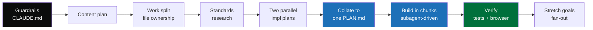

Two load-bearing nodes: **PLAN.md** (single source of truth) and the
**subagent-driven build loop**. Everything before PLAN.md exists to make that loop safe to run fast.

---

# Phase 1 — Guardrails before any code

The first real commits weren't features. They were **rules** (`CLAUDE.md`):

- **Agent identity** — ask for a name; prefix every commit + log entry with it.
- **Git workflow for a shared repo** — `git pull --rebase` before *and* after work;
  resolve conflicts preserving *both* agents' intent; never `git add .` blind; push immediately.
- **AI_LOG discipline** — the log entry and the work it documents ship in the **same commit**.

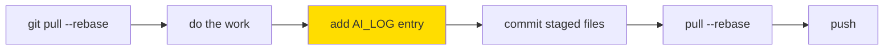

> Engineering takeaway: with several agents committing concurrently, **process is the
> conflict-avoidance mechanism**. You pay for it up front, once.

---

# Phase 2 — Content-first planning

Before a line of React, Agent-Jack wrote a **content plan**: every page's copy,
every radio option + value, hint text, error messages, the eligibility rules in
plain language, and result-page copy for every outcome.

Why content first?

- For a GOV.UK service the **copy *is* the spec** — outcomes, error text and labels
  are requirements, not decoration.
- It let later code chunks copy text **verbatim** instead of inventing it
  ("do not invent copy" became a rule).

Human review of this artefact: accepted as-is. Decisions like "three income bands, not free-text"
and hedged grant amounts ("up to £10,000") were judged reasonable for a fictional scheme — and recorded as such.

---

# Phase 3 — Parallelism by design: file ownership

The work-split plan's core principle: **if no two agents touch the same file,
there are zero merge conflicts.** Every file got exactly one owner.

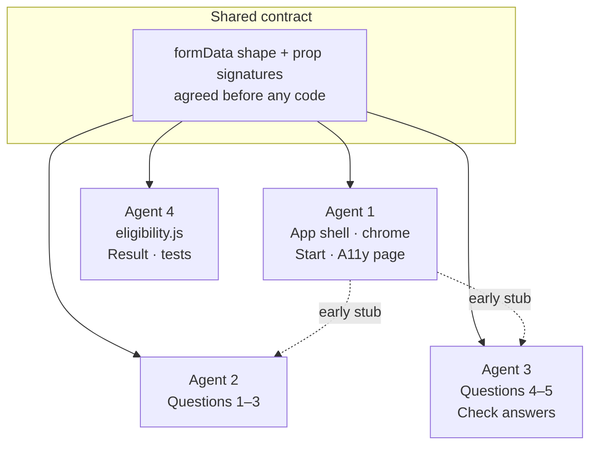

The **one unavoidable shared file** was `AI_LOG.md` — mitigated by append-only,
clearly-labelled blocks. `App.css` was declared *do-not-modify*.

---

# Phase 4 — Standards research, adversarially checked

Agent-Research produced a 10-section report (PSBAR, Equality Act, UK GDPR/PECR,
GDS Service Standard, WCAG 2.2 AA, the GOV.UK Design System) — then had it **sanity-checked
by subagents** before anyone relied on it.

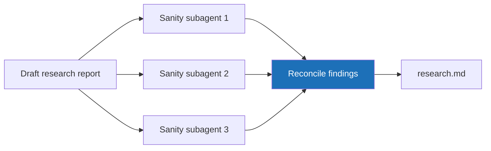

The reviewers caught **real errors**: WCAG criteria mislabelled AA when they're Level A;
an accessibility-statement section count off by one; and a **major omission** — the
"Check if a service is suitable" eligibility-screening pattern, central to *this* service.

---

# Phase 5 — Two plans, deliberately kept side by side

Two agents drafted **competing implementation plans in parallel** (Jack and SK).
Rather than force an early merge, the user kept **both** and deferred reconciliation.

The plans genuinely diverged on architecture:

| Decision | Jack's plan | SK's plan |
|---|---|---|
| Form state | Prop drilling (`formData`) | React Context (`useFormContext`) |
| Question pages | Per-page implementation | Generic `<QuestionPage>` |
| `eligibility()` return | `{ result, measures }` | `{ outcome, reason, measures }` |
| Routes | Inline in `App.jsx` | Dedicated `router.jsx` |

> Pattern: **let strong proposals compete**, capture the trade-offs explicitly,
> then choose deliberately — instead of the first plan winning by default.

---

# Phase 6 — Collate into one source of truth

Agent-Jack synthesised all five docs into a single, agent-agnostic **`PLAN.md`**:
17 architecture decisions (with rationale + source), shared contracts, copy-paste
reference patterns, a WCAG checklist citing SC numbers, and a 13-row test matrix.

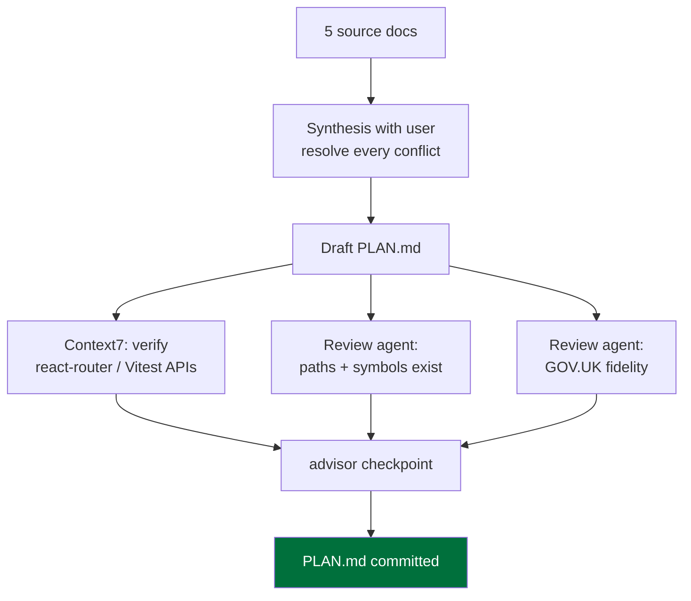

Both the **competing-approach choices** and the **review fixes** were resolved
*with the user*, not silently — including reversing one decision the reviewer
got right but that violated a "do-not-change-without-flagging" instruction.

---

# What the plan produced: the service architecture

Planning crystallised the contracts the whole team then built against.

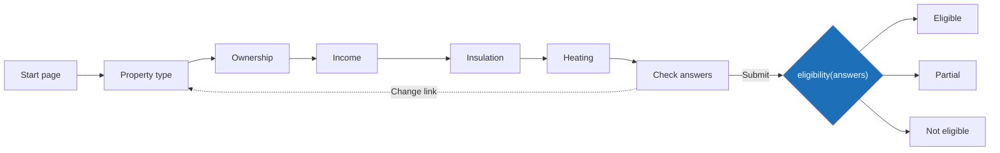

**Shared contracts:** a flat `Answers` object in React Context · a pure
`eligibility(answers) → { outcome, reason, measures }` · one generic `<QuestionPage>` ·
a 9-route table. The `reason` code drives result-page copy variants.

---

# Phase 7 — The subagent-driven build loop

This is the heart of the build. Each PLAN.md "chunk" ran through the **same loop**,
with *fresh* subagents at each stage so no context contaminated the review.

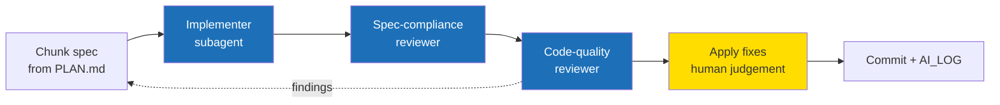

Four chunks: **(1)** test infra + contracts + eligibility tests · **(2)** shared component
library · **(3)** chrome + App wiring + routes + CSS · **(4)** all 9 pages.
Tests stayed green (16 → 21) and `npm run build` exited 0 at every step.

---

# What the review loop actually caught

The loop's value is the **specific, real defects** it surfaced — not theatre:

- **AD8 reversed**: focusing `<h1>` inside a `<legend>` on route change makes NVDA/JAWS
  double-announce → changed to focus `<main>`, the pattern live GOV.UK uses.
- **Rule-priority tests added**: original tests passed even if eligibility rules were
  re-ordered. Added cases proving rule 1 beats rule 2, and rule 3 beats rule 5.
- **Wordmark `href="/"` → `https://www.gov.uk/`**: the relative link would full-reload
  and **wipe the form state**. Caught by the code-quality reviewer.
- **A test that didn't test what it claimed**: a "pre-checked radio" test re-tested the
  onChange binding; reworked to seed Context and assert on mount (and fixed an infinite
  render loop the rework exposed).

> Note the discipline of **skipping** findings too — each skip recorded *with a reason*.

---

# The AI_LOG — the human-in-the-loop audit trail

Every meaningful AI task got a four-field entry. The fourth field is the one that matters.

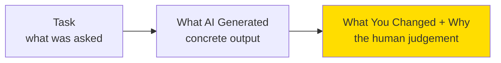

| Field | Why it exists |
|---|---|
| **Date + Time** | Orders the build; ties entry to commit |
| **Task** | The intent given to the AI |
| **What AI Generated** | Concrete enough to understand *without* reading the code |
| **What You Changed + Why** | The review — *or* an explicit "nothing changed, because…" |

13 entries tell the whole story: planning artefacts accepted as-is, code chunks with named fixes,
and stretch work with flagged deviations. It is the assessment evidence *and* the project memory.

---

# Phase 8 — Verification: tests vs *feature* correctness

The team drew a deliberate line:

- **Unit/component tests** (Vitest + RTL) verify *code* correctness — 21 passing.
- Only a **real browser run** verifies *feature* correctness.

So the final step drove the running dev server through the **entire user journey via
Playwright MCP**: start → question → validation error summary (focus + `document.title`) →
happy path → check-answers Change-link round trip → all result variants → empty-state guards →
accessibility statement → phase banner copy.

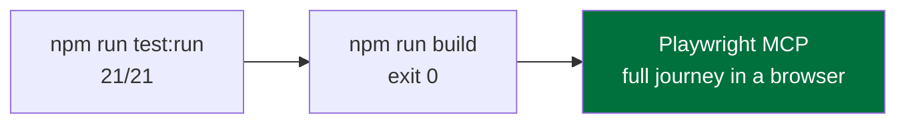

Findings were environment-only (HMR socket, favicon 404) — no app errors. Day 2 hardened this
manual pass into a committed, automated Playwright E2E suite (see the stretch slide).

---

# Phase 9 — Stretch goals: fan-out on branches

With the MVS shipped, work fanned out onto **independent branches**, each merged back via PR.

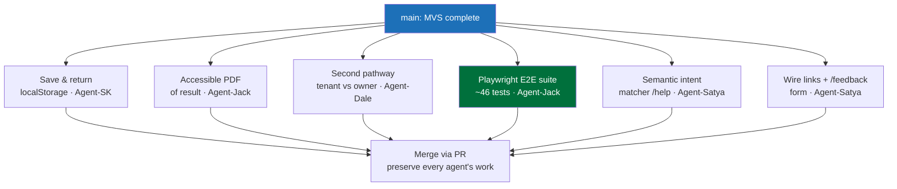

Branch-per-stretch scaled the file-ownership principle up to whole features. The unit
suite grew **21 → 86 tests**, joined by a **46-test Playwright E2E suite** (with axe WCAG 2.2
AA scans) — which caught a real **320px reflow** bug the unit tests had missed.

---

# Deep dive — the second eligibility pathway

The stretch goal: make the *questions* diverge by tenure, not just the outcome.
Agent-Dale **researched first** (grounded in the actual code), then implemented.

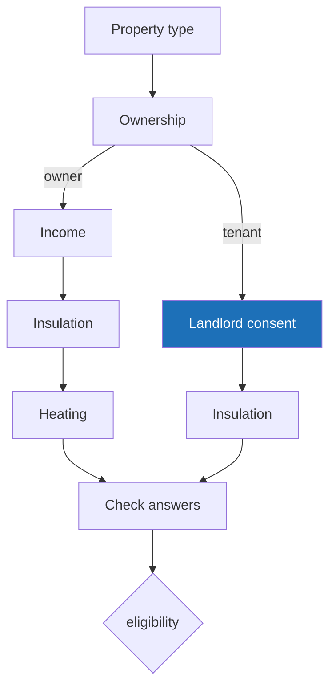

- Branch on the **existing `ownership` field** via an `isTenant()` helper — no new state machine.
- `onContinueNavigateTo` made to accept **a function of answers** (≈3-line change).
- The hard part: the "redirect if any field missing" guards had to become **path-aware**.

---

# Second pathway — deviations, flagged not hidden

Three settled PLAN.md decisions had to change. Each was **flagged to the user before
implementing**, and recorded in the AI_LOG:

1. **"Step X of 5" indicator** becomes a lie on the 4-step tenant path →
   made `totalSteps` path-aware (kept the indicator, stopped it lying).
2. **Rule ordering**: tenure now checked *before* the income gate, so the
   high-income exclusion is owner-only. All 14 prior tests still pass unchanged.
3. **`landlordConsent` answer key** added; the "second pathway" non-goal lifted under
   explicit user direction.

> Browser verification was unavailable that session, so instead of skipping it, Agent-Dale
> added **committed full-journey integration tests** driving both paths through jsdom —
> stronger and reusable. Result: **39/39 tests pass**, build clean.

---

# Timeline — two days, many hands

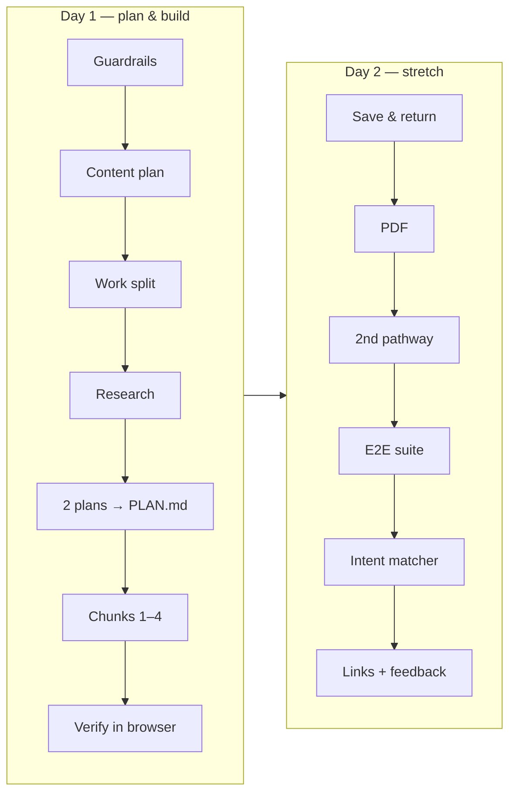

Roughly **40+ commits** across five agent identities and several branches —
all reconstructable from the git log + `AI_LOG.md`, which is the point.

---

# What worked — lessons for AI-mediated dev

- **Guardrails first.** Identity + git workflow + logging rules paid for themselves the
  moment a second agent pushed.
- **Plan until the contracts are boring.** A flat state shape, a pure function, one
  generic page component — settled in `PLAN.md` — made parallel building safe.
- **Fresh subagents review fresh code.** Separating implementer / spec-reviewer /
  quality-reviewer caught defects an author wouldn't see in their own work.
- **Verify the feature, not just the code.** Tests are necessary; a browser run is the proof —
  and the automated E2E suite's 320px check caught a real WCAG reflow bug the unit tests missed.
- **Record the *why* of every change.** "What you changed + why" is where the engineering
  judgement — and the auditability — actually lives.

---

<!-- _class: lead -->

# Takeaway

## AI didn't replace the engineering process. **It ran on top of it.**

 

The leverage came from old disciplines — **specs, ownership, review, audit trails** —
applied to a team of agents moving fast.

 

Sources: `wk03/starter/AI_LOG.md`, the git history, `wk03/docs/PLAN.md` and the planning/research docs.
A process retrospective — it documents the build rather than changing the application code.
